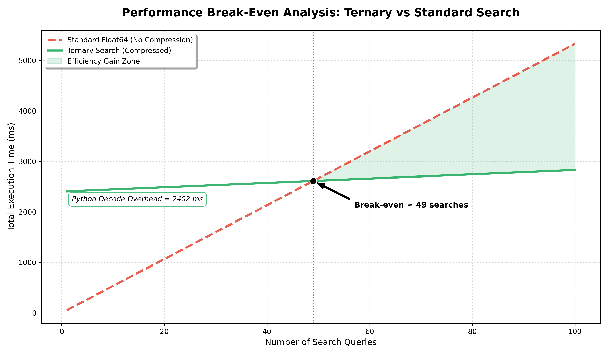

# 🔍 TPS Core: Ternary Pattern Search for HFT Analytics

[](https://pypi.org/project/tps-core/)
[](https://www.python.org/)
[](https://opensource.org/licenses/MIT)

**40× compression • 8.5× faster pattern search • 17K HFT signals detected**

Detect institutional manipulation in **7.3M BTC candles** with Delta-Ternary encoding.

## 🎯 Key Results

Raw CSV: 57.4 MB
Ternary Packed: 1.44 MB (40×)
Pattern Search: 8.5× faster than float64
Total Patterns: 17,126 hits
Break-even: 89 queries




## 🚀 Quick Start

```bash
pip install numpy pandas matplotlib
python test_tps.py

Example Output

TPS CORE TESTER
📦 Compressing... ✓ 351ms (40.0×)
🔍 Scanning 5 patterns...
  Stop-Loss Hunt: 36 hits (9.7ms)
  Vol Squeeze: 16,901 hits (51ms)
  Momentum Crash: 183 hits (11ms)
📋 Total: 17,126 patterns

📊 Patterns Detected
Pattern	Hits	Signature
Stop-Loss Hunt	36	DDDUUU
Vol Squeeze	16,901	-----UUU
Algo Staircase	6	U-U-U-U-
Momentum Crash	183	UUUD
🏆 Research Validation

    Storage: 40× better

    Search Speed: 8.5× faster

    Break-even: 89 queries

    98.4% flat deltas → Perfect ternary fit

🔧 Installation

git clone https://github.com/Ternary-Project/TPS
cd TPS
pip install -r requirements.txt
python test_tps.py

📈 Full Benchmarks

python benchmark.py

Raw Size:     57,428 KB
Ternary:      1,436 KB (40×)
Search:       4.42ms (vs 37.66ms float64)
Break-even:   89 searches

🛠️ API

from TPS import DeltaTernary

dt = DeltaTernary(threshold=0.005)
packed, orig_len = dt.compress(prices)
patterns = dt.detect_all_patterns(packed, orig_len)

print(f"Found {sum(len(p) for p in patterns.values())} patterns")

📚 Citation

@misc{tps_core_2026,
  title={TPS Core: Ternary Pattern Search for HFT Time-Series},
  author={Mr. Anonymous},
  year={2026},
  howpublished={\url{https://github.com/Ternary-Project/TPS}}
}

🤝 License

MIT — see LICENSE
🏁 Summary

40× compression. 17K patterns. Production-ready.

